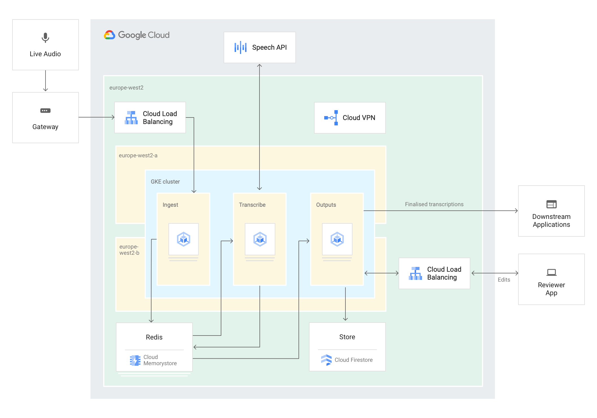

# live-captioning
Uses the Google Cloud [Speech-to-Text API](https://cloud.google.com/speech-to-text/) to transcribe a live audio stream. 
App is deployed as a set of highly available services to [GKE](https://cloud.google.com/kubernetes-engine/). 
Uses a leader-election pattern to maintain a stateful connection to the API.
Work in progress.

## Architecture
Not all elements of this diagram are currently implemented.


## Description
* The core of the app is a [regional GKE cluster](https://cloud.google.com/kubernetes-engine/docs/concepts/types-of-clusters), 
deployed over two zones
* Three independent [deployments](https://cloud.google.com/kubernetes-engine/docs/concepts/deployment) within the cluster
  * Ingest: receives the source audio and stores in Cloud Memorystore for Redis.
    * Deployed as a [Service](https://cloud.google.com/kubernetes-engine/docs/concepts/service), with a load balancer. This provides a single ingest IP address 
  * Transcribe: reads the stored audio, performs streaming recognize requests against the Cloud Speech API.
  Transcription results are stored in Redis. More details below.
  * Outputs: consume the transcription results and perform business logic. There might be several different
   flavours of Output components e.g.
     * Stream the transcriptions to a web app for review/edit
     * Persist the transcriptions for compliance/analysis
* Each deployment is replicated across the two zones for increased availability
* Cloud Memorystore for Redis is used for intermediate storage. This provides low-latency, in-memory storage
suitable for real time activities. Can be deployed in a highly-available configuration (replicated over two zones)

#### Transcribe details
* Performs [streaming recognize](https://cloud.google.com/speech-to-text/docs/basics#streaming-recognition) requests against the Cloud Speech API
* This opens a bi-directional gRPC stream to the API; audio is sent to the API, and transcription results are
asynchronously received. The Speech API client libraries abstract away the gRPC logic.
* The connection to the API is stateful; transcription results can evolve as more audio is received by the API.
* While the Transcribe deployment is replicated across zones, only a single pod (the leader) communicates with
the API at a given point
  * This is achieved using a [leader election](https://en.wikipedia.org/wiki/Leader_election) pattern.
  * The Kubernetes [Go client](https://github.com/kubernetes/client-go/tree/kubernetes-1.14.7/tools/leaderelection)
  provides some built-in logic to do leader election
  * Simply speaking, the deployed Transcribe pods compete to acquire a lock that is managed by the Kubernetes control plane. 
  One pod is elected as leader for a defined period of time. The leader continually “heartbeats” to renew its position as the 
  leader, and the other pods periodically make new attempts to become the leader. This ensures that a new leader is identified quickly 
  if the current leader fails. 
  * The leader election is performed by a sidecar container, so the leader election logic is kept separate
  from the core transcription logic


## Deploy & test the app
#### Setup, create infrastructure
Rather than working in Cloud Shell, these instructions assume you are working on your local machine.
This is because there are some hassles to get audio pacakges to work with Cloud Shell. You still create
infrastructure in GCP, but execute the commands to do so locally.
* Create a new GCP Project. You'll need to give it a unique name
  * ```gcloud projects create %your_project_name```
* Once the above is complete, initialise your local config to use the new project. Step through the process.
  * ```gcloud init```
* Enable the relevant APIs. This can take a few mins.
  * ``gcloud services enable speech.googleapis.com container.googleapis.com redis.googleapis.com cloudbuild.googleapis.com``
* Create a GKE cluster. Changes the zones to your preference. This can take a few minutes
  * ``gcloud container clusters create captioning-cluster --cluster-version=1.14.7 --region=europe-west1 --scopes=gke-default,cloud-platform --machine-type=n1-highcpu-2 --num-nodes=1 --node-locations=europe-west1-b,europe-west1-d --enable-ip-alias``
* Get the cluster credentials
  * ```gcloud container clusters get-credentials captioning-cluster --region=europe-west1```
* Create a Cloud Memorystore instance. This can take a  few mins
  * ```gcloud redis instances create redis-captions --tier=standard --region=europe-west1 --zone=europe-west1-b```
* Export the IP address of the Memorystore instance
  * ```export REDIS_HOST=`gcloud redis instances describe redis-captions --region=europe-west1 | sed -n 's/host: //p'` ```

#### Deploy the app
* Clone this repo
  * ```git clone https://github.com/jtangney/live-captioning.git```
* Change directory
  * ```cd live-captioning```
* Build the Docker containers. They will be exported to your project's container registry
  * ```gcloud builds submit --config cloudbuild.yaml```
* Edit the yaml files to set your project ID
  * ```sed -i "s/mynewproject/$DEVSHELL_PROJECT_ID/" k8s/*.yaml```
* Edit the yaml files to set the IP address of the Cloud Memorystore instance
  * ```sed -i "s/redisHost=.*/redisHost=$REDIS_HOST/" k8s/*.yaml```
* Create the Deployments and Services in the cluster
  * ```kubectl apply -f k8s/ingestor.yaml,k8s/transcriber.yaml,k8s/editor.yaml```
* Verify that the 3 deployments have been created. 
  * ```kubectl get deployments```
  
#### Test
* Get the external IP of the Ingest service
  * ```export INGEST_IP=`kubectl get services ingestor-service -o yaml | sed -n "s/- ip: //p"` ```
* Verify that the Ingest service is up and running
  * ```curl $INGEST_IP; echo```
* Get the external IP of the Editor service
  * ```kubectl get services editor-service -o yaml```
* Open a browser window to the IP address above. Transcriptions will be written to this web page.
* The test client is a Python script that uses [PyAudio](http://people.csail.mit.edu/hubert/pyaudio/).
 PyAudio requires to install some system audio package. The command below assumes you are on a Mac, and use Homebrew.
  * ```brew install portaudio```
* Setup the client. This assumes you have python 3.7 and virtualenv installed.
  * ```cd client```
  * ```virtualenv venv```
  * ```source venv/bin/activate```
  * ```pip install -r requirements.txt```
* Play local audio file and send audio to Ingest IP. The file will continuously play.
  * ```python socketio_client.py --targetip=$INGEST_IP --file=pager-article-snippet.wav```
* Switch to the browser window that has the Editor app; you should see transcriptions coming through

#### Experiment
* You can change the played audio file via the --file option. Refer to the Speech API [best practices](https://cloud.google.com/speech-to-text/docs/best-practices)
about supported audio. The ```k8s/transcriber.yaml``` file defines the expected audio configuration; if you
need to change the config, update the yaml and redeploy
  
